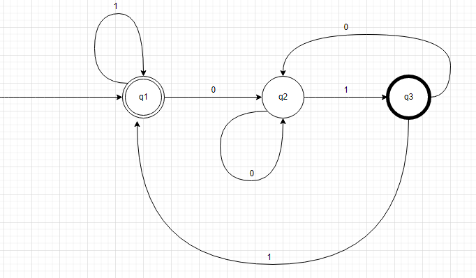
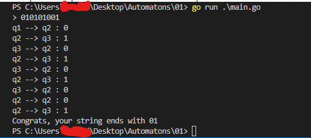
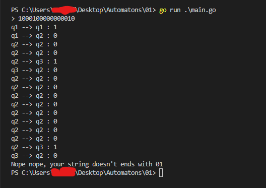

# Simple Deterministic Automaton implementation in go

## Intro

This automaton detects if a binary string ends with the
sequence `01`.

So the sequences: `001`, `10010101`, `01001`, `1111101` are validated by it.

## State Machine

|   | 0 | 1 |
| ------- | ----- | ---|
|-> q1| q2 | q1|
| q2 | q2 | q3 |
|* q3 | q2 | q1 |

## Demo

Running against a valid string

Running againt an invalid string.  

